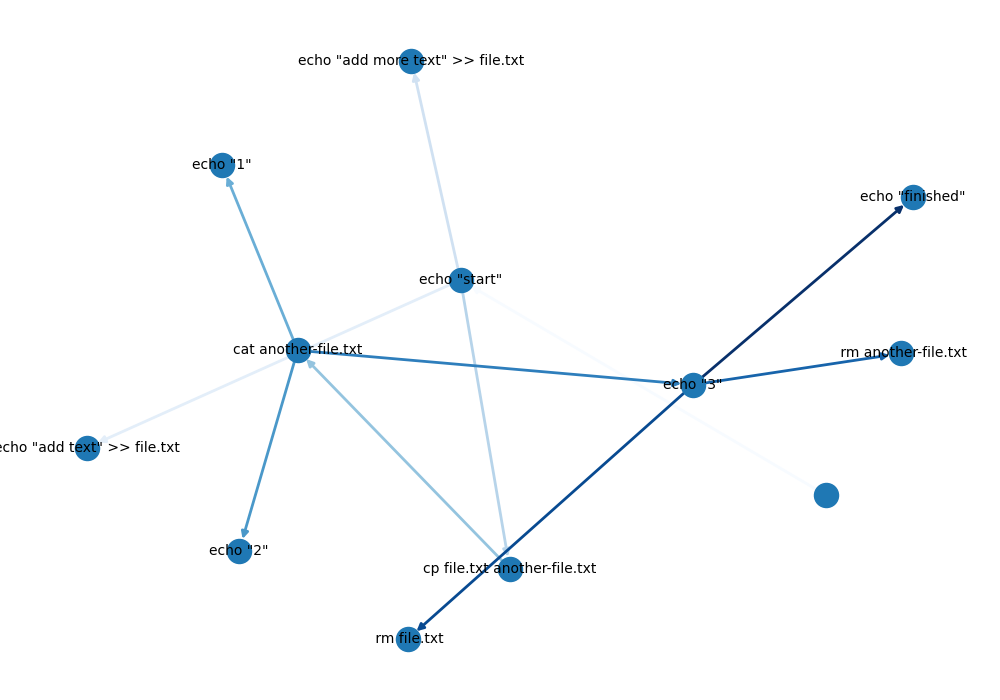

# workforce
A tool for running commands with multiprocessing according to a csv file schema 

Install requirements with:
`pip3 install -r requirements.txt`

Run a test with:
`python3 workforce.py -g -i example_instructions.csv`

will run the commands, produce a log, and a graph of the command history that looks like:

Options:
- -g Make a png with the nodes of the program based on the instructions
- -d Can specify an additional directory of scripts for use in the instructions

The schema should be in the format of a csv with two columns. On the left and right column is the source and target command respectively (see example). Produces a logfile for each run. If running from a bash shell, the following alias can be made to the bashrc if the git repository is in your home directory:

`alias wf="~/workforce/workforce.py"`
