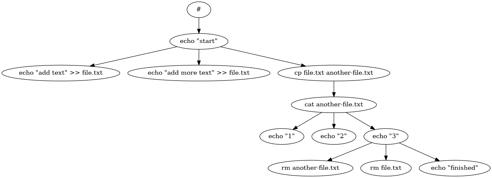

# workforce
A tool for running bash commands with python multiprocessing according to a csv file edgelist. There are no requirements for the default program that are outside the Python Standard Library.

## installation
pip install workforce

To try a sample plan, run with:

`python workforce.py example_plan.csv`

To view the program graph, networkx and matplotlib are required. The -g flag is required to produce a dot file of the network:

`python3 workforce.py -g example_plan.csv`

Converting the graph to a dot can be done using an online dot viewer or using Graphviz software with the example command:

`dot -Tpng -Kdot -o <DOT_FILENAME>.png <DOT_FILENAME>`

The schema should be in the format of a csv with two columns. On the left and right column is the source and target command respectively (see example). Produces a logfile for each run.

Testing can be done within this directory by running:
`python -m unittest -v`
