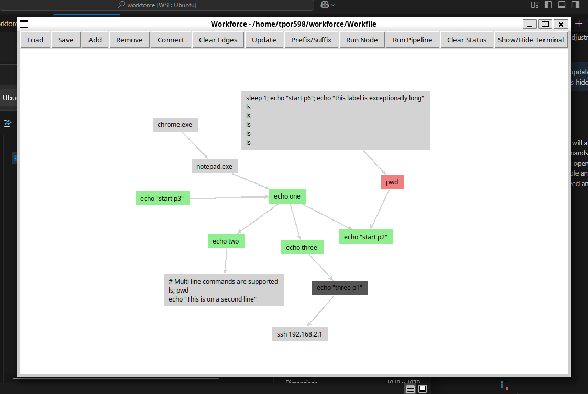
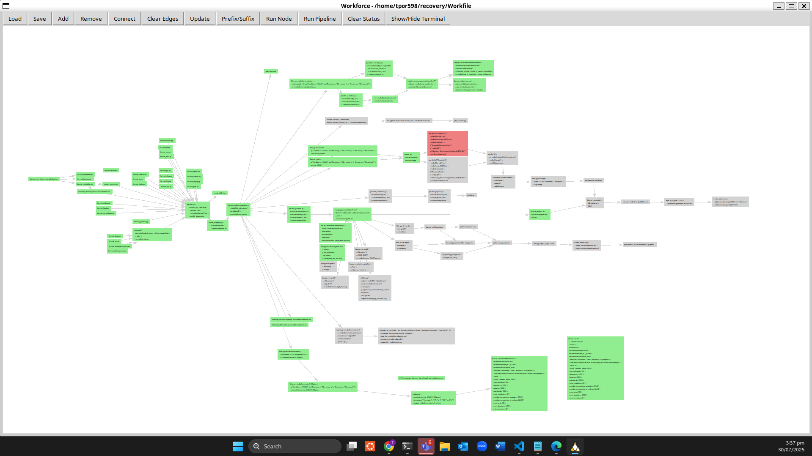

=========
workforce
=========

.. image:: https://img.shields.io/pypi/v/workforce.svg
    :target: https://pypi.python.org/pypi/workforce

.. image:: https://readthedocs.org/projects/workforce/badge/?version=latest
    :target: https://workforce.readthedocs.io/en/latest/?badge=latest
    :alt: Documentation Status

Workforce is an application that creates and runs bash commands in the order of a graph. It serves as a desktop for terminals, allowing you to build and run pipelines of bash commands with python multiprocessing according to a graphml file.

Similar to other workflow management systems like Galaxy workflow, QIIME plugin workflows, AnADAMA2, Snakemake, Nextflow, and Make, but designed with multiuser support and a graphical interface for workflow editing.

* Free software: MIT license
* Documentation: https://workforce-documentation.readthedocs.io.

Features
--------

* **Graph-based workflow execution**: Define bash commands as nodes in a directed graph
* **Multiuser support**: Multiple clients can interact with the same workflow simultaneously
* **Server-based architecture**: Workflows are served via Flask API with unique URLs
* **Event-driven execution**: Dependency-aware scheduling with real-time status updates
* **Subset execution**: Run specific subgraphs or the entire workflow
* **Resume capability**: Restart failed nodes and continue pipeline execution
* **Interactive GUI**: Edit workflows visually with a Tkinter-based interface
* **Flexible command wrapping**: Add prefixes/suffixes to commands (Docker, SSH, tmux, etc.)

Architecture Overview
---------------------

Server
~~~~~~

The server component manages workflow execution through a registry-based system:

**Server Startup**: When starting a server using the CLI (``python -m workforce server start``):

1. Checks if the Workfile (absolute path) has been assigned a URL in the shared Registry file
2. If not assigned, starts a Flask API server on a unique URL (or uses a URL provided via CLI if available)
3. Registers the Workfile + URL mapping in the Registry with:
   - Initial client count set to 1
   - Process ID (PID) for server management
   - Port number for connection

**Server Operations**:

- Accepts requests to modify the Workfile using the ``edit`` API
- Accepts requests to run the Workfile using the ``run`` API with arguments:
  - ``subgraph``: Specific nodes to include in execution
  - ``selected``: Explicitly chosen nodes
  - ``wrapper``: Command prefix/suffix wrapper

**Server Shutdown**: On stop or failure:

- Fails all running processes gracefully
- Removes Workfile + URL mapping from Registry
- Cleans up resources (heartbeat monitoring)

Unified Execution Model
~~~~~~~~~~~~~~~~~~~~~~~~

The system employs a unified execution model where every run is treated as a subset run:

**Node Selection**:

- If specific nodes are selected (via CLI or GUI), those nodes form an induced subgraph for execution
- If no nodes are explicitly selected:
  - The system first checks for failed nodes and selects them for re-execution
  - If there are no failed nodes, nodes with zero in-degree in the full workflow are selected
  - This means by default, the entire workflow is treated as the active subset

**Execution Initialization**: Upon initialization, the scheduler:

1. Identifies all nodes within the target subset that have an in-degree of zero relative only to that subset
2. Transitions these nodes to a "run" state
3. Ensures nodes start immediately if their dependencies in the master workfile are omitted from the current run scope

**Subgraph Boundaries**: To prevent execution from bleeding into the rest of the workfile:

- The scheduler strictly enforces subnetwork boundaries
- Propagation is confined entirely to the active selection
- When a node completes, only outgoing edges within the filtered subnetwork are evaluated
- Edges leading to nodes outside the original subset are ignored, effectively "capping" the execution

Execution Loop and Dependency Management
~~~~~~~~~~~~~~~~~~~~~~~~~~~~~~~~~~~~~~~~~

**Node Execution**:

1. When a node runs, its stdout and stderr are captured as node attributes
2. These outputs are viewable from the GUI (with the 'l' shortcut key)
3. Upon successful completion, an event is emitted to the run request
4. Each event is tagged with a client ID, allowing multiple concurrent runs and GUI clients to operate without interference

**Scheduler Operations**:

1. The emission triggers the scheduler to retrieve the filtered subnetwork map
2. All valid outgoing edges (within the subnetwork) are updated to a ``to_run`` status
3. An edge-status change event is broadcast

**Dependency Checking**:

1. The status change prompts the target node to perform a dependency check
2. The node transitions to the ``run`` state only if ALL incoming edges (within the subnetwork context) are marked as ``to_run``
3. Once this condition is satisfied:
   - The node clears the statuses from those incoming edges
   - Begins execution
   - Loops back to the capture and emission phase

This mechanism ensures the engine only advances when subset-specific dependencies are fully met.

Resume Logic
~~~~~~~~~~~~

The resume functionality (Shift+R in GUI) handles failures or cancellations:

- Replaces a node's ``failed`` status with ``run``
- Re-triggers the event loop, which causes the scheduler to re-check dependencies and queue the node for execution
- Allows the remainder of the pipeline to proceed through the normal dependency checking process
- Strictly bounded by the subset; resume never propagates to nodes outside the original selection
- Ensures nodes do not remain in a running state indefinitely

By ensuring clean status management and ignoring edges outside the active scope, the system guarantees a clean termination once the selected subgraph is exhausted.

Installation
------------
Installation can be done with:

.. code-block:: bash

   pip install workforce

Building a workforce workflow
-----------------------------
To launch the pipeline editor, run:

.. code-block:: bash

   wf

or:

.. code-block:: bash

   python -m workforce

To open a previously constructed pipeline, run:

.. code-block:: bash

   wf <PIPELINE.graphml>
    
If a `Workfile` is in the current directory:

.. code-block:: bash

   wf

Running workforce plan
----------------------
To run a plan from the GUI, click the 'Run' button or press 'r'. If nodes are selected, execution starts from those nodes. Otherwise, the full pipeline is executed. Run from cli with:

.. code-block:: bash

   wf run Workfile

Prefix and Suffix
-----------------
Adding the following prefix and suffixes to the wf run command (or within gui) will add those prefix and suffixes to each command ran by the pipeline.

+-------------------------------------------------+---------------------------------------------------------------------------+--+--+--+--+--+--+--+--+
| Wrapper Command                                 | Description                                                               |  |  |  |  |  |  |  |  |
+=================================================+===========================================================================+==+==+==+==+==+==+==+==+
| --wrapper 'bash -c "{}"'                        | Standard bash execution                                                   |  |  |  |  |  |  |  |  |
| --wrapper 'bash -c '. env.sh ''                 | Bash execution with definition of config or other environmental settings  |  |  |  |  |  |  |  |  |
| --wrapper 'tmux send-keys {} C-m'               | Sends each command to a tmux session and executes it.                     |  |  |  |  |  |  |  |  |
| --wrapper 'ssh ADDRESS {}'                      | Executes each command remotely on the specified server.                   |  |  |  |  |  |  |  |  |
| --wrapper 'parallel {} ::: FILENAMES'           | Runs the pipeline on each specified filename.                             |  |  |  |  |  |  |  |  |
| --wrapper 'docker run -it IMAGE {}'             | Executes each command inside a Docker container with an interactive TTY.  |  |  |  |  |  |  |  |  |
| --wrapper 'echo {} >> commands.sh'              | Exports pipeline commands to a bash script named commands.sh.             |  |  |  |  |  |  |  |  |
| --wrapper 'bash -lc "conda activate ENV && {}"' | Activates a Conda environment before executing the command.               |  |  |  |  |  |  |  |  |
| --wrapper 'nohup {} &'                          | Runs commands in the background.                                          |  |  |  |  |  |  |  |  |
+-------------------------------------------------+---------------------------------------------------------------------------+--+--+--+--+--+--+--+--+

To run specific process(es) from the editor, select the process(es) and click the 'Run' button (or shortcut with 'r' key). If no processes are selected, the entire pipeline will run. Opening the terminal with shortcut 't' (or on the toolbar), you can see the output of the commands.

This is tested on mac, linux, and windows powershell and wsl2.
